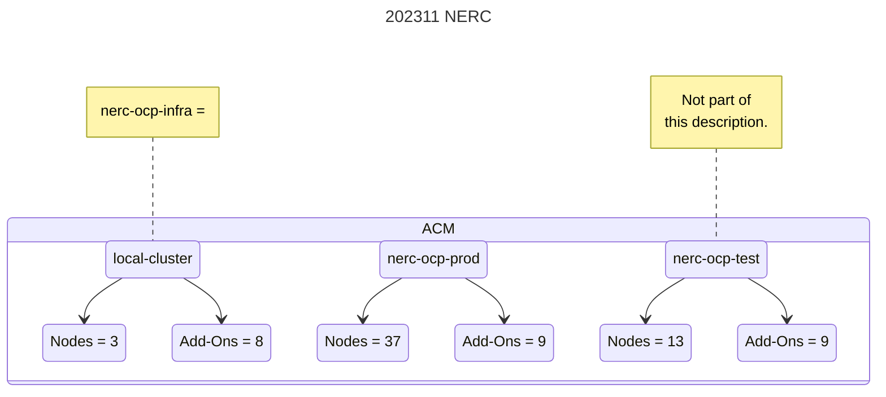

# Table of Contents
1. [Use case](#use-case)
1. [Background](#background)
1. [Solution overview](#solution-overview)
1. [Summary video]()
1. [Logical diagram]()
1. [The technology]()
1. [Architectures]()
    1. [Event Driven Automation (network)]()
    1. [Event Driven Automation (data)]()
1. [Download diagrams]()
1. [Provide feedback](#provide-feedback)

## Use case 
## Background
## Solution overview
## Summary video
## Logical diagram
## The technology
## Architectures
### Event Driven Automation (network)
### Event Driven Automation (data)
## Download diagrams
## Provide feedback 
