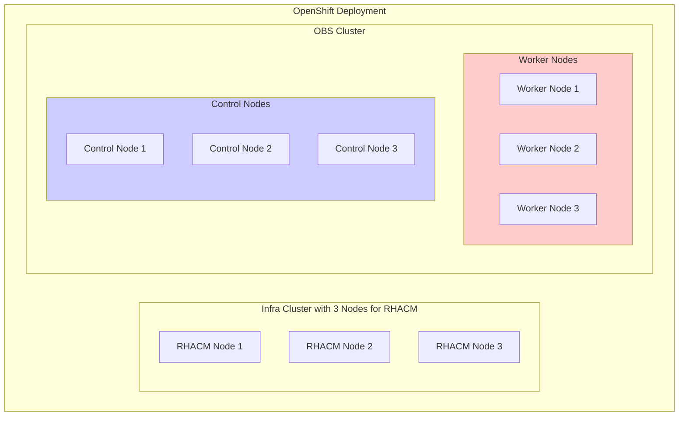
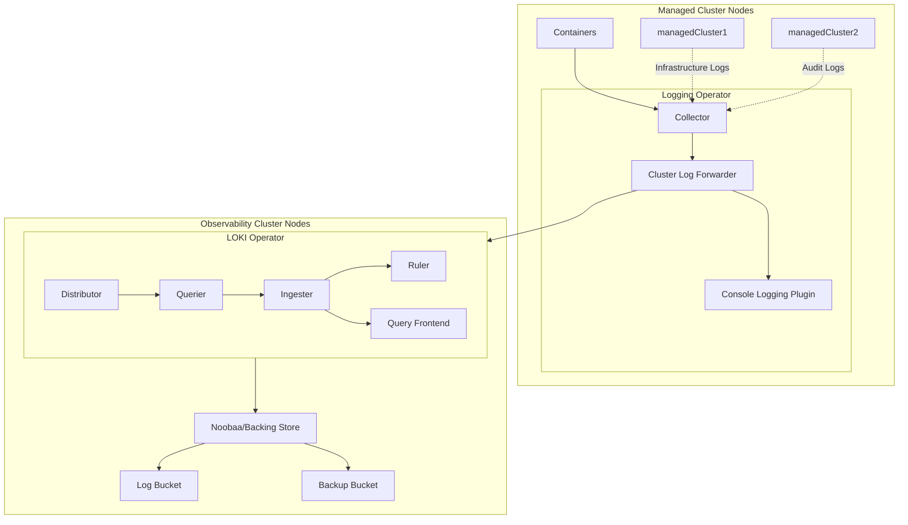

```mermaid
graph TB
  subgraph OpenShift Deployment
    subgraph Infra Cluster [Infra Cluster with 3 Nodes for RHACM]
      InfraNode1[RHACM Node 1]
      InfraNode2[RHACM Node 2]
      InfraNode3[RHACM Node 3]
    end

    subgraph OBS Cluster [OBS Cluster]
      subgraph WorkerNodes [Worker Nodes]
        style WorkerNodes fill:#ffcccc
        Worker1[Worker Node 1]
        Worker2[Worker Node 2]
        Worker3[Worker Node 3]
      end

      subgraph ControlNodes [Control Nodes]
        style ControlNodes fill:#ccccff
        Control1[Control Node 1]
        Control2[Control Node 2]
        Control3[Control Node 3]
      end
    end
  end
```

```mermaid
graph TD
    subgraph managedCluster["Managed Cluster Nodes"]
        subgraph loggingOperator["Logging Operator"]
            collector[Collector] --> clusterLogForwarder[Cluster Log Forwarder]
            clusterLogForwarder --> consoleLoggingPlugin[Console Logging Plugin]
        end
        containers[Containers] --> collector
        managedCluster1 -.-> |Infrastructure Logs| collector
        managedCluster2 -.-> |Audit Logs| collector
    end

    subgraph observabilityCluster["Observability Cluster Nodes"]
        subgraph lokiOperator["LOKI Operator"]
            distributor[Distributor] --> querier[Querier]
            querier --> ingester[Ingester]
            ingester --> ruler[Ruler]
            ingester --> queryFrontend[Query Frontend]
        end
        lokiOperator --> noobaa[Noobaa/Backing Store]
        noobaa --> logBucket[Log Bucket]
        noobaa --> backupBucket[Backup Bucket]
    end

    clusterLogForwarder --> lokiOperator
```
